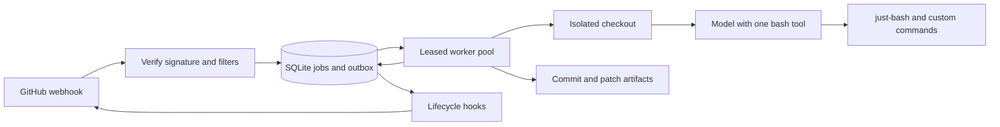

# Issue agent design

GitHub signs each webhook. The HTTP handler verifies the raw request, normalizes supported issue/comment events, applies repository and trigger filters, and commits a deduplicated job before acknowledging it. Newly opened issues require no label or author filter by default. Comments prefixed with `/agent` create follow-up runs; bot comments and the agent's own marked comments are ignored.

## Durability

SQLite runs on a local persistent disk with WAL, `synchronous=FULL`, a busy timeout and explicit transactions. Delivery IDs are unique. Claims are atomic and use expiring leases with unguessable tokens; completion, renewal and tool side effects require the current token. Expired attempts are retried with backoff and bounded attempts. Different issues may run concurrently; one issue is serialized. Every attempt gets a different workspace so a stale worker cannot corrupt its successor's files.

Job state and outgoing comments/reactions use a transactional outbox. Hook delivery failures do not rerun successful code changes. Delivery remains at least once: GitHub and SQLite cannot share an atomic transaction. Comment markers and reaction uniqueness reduce duplicates. The SQLite backup command produces a consistent snapshot; copying only the database while WAL is active is unsafe. Durability depends on the filesystem/device honoring sync operations. Tests can verify process crashes and reopen behavior, not simulate every storage device losing power.

## Agent and extension points

The model receives only a bash execution tool. just-bash reads and writes a dedicated checkout; credentials, the queue, trusted service code and Git metadata are outside its filesystem. It gets no arbitrary host shell, network access, or package manager by default. Trusted capabilities compose as custom just-bash commands. A model adapter is replaceable independently of the runner. Lifecycle hooks produce durable comment/reaction effects independently of the model.

The host clones the configured GitHub repository into a managed source cache, then prepares a separate checkout and Git metadata directory for each attempt. Git operations use argument arrays and disabled hooks. Successful runs preserve a commit and patch in local artifacts; automatic pushing and pull request creation are not implemented. Comment follow-ups start from the last completed commit for the issue, including an older job retried after a newer job. SQLite records that issue's accepted result in the fenced completion transaction. Source checkout changes and unrelated issues are isolated.

## GitHub authentication

When `GITHUB_APP_CLIENT_ID` and `GITHUB_APP_PRIVATE_KEY_PATH` are both configured, the host reads and validates the RSA key at startup and keeps it in the process. It takes precedence over static `GITHUB_TOKEN`; configuring only one App setting is an error. The shared in-memory provider requests a repository-scoped installation token on first use, then refreshes on demand within 60 seconds of expiry. Concurrent calls share a refresh. REST calls and each Git clone/fetch obtain a usable credential; a REST 401 or explicit Git authentication rejection triggers one refresh and retry. Clone/fetch 404s, permission denials, and network failures do not trigger an authentication retry; normal worker retries apply. No token is persisted and no timer runs while idle. Installation tokens expire after an hour, but the service mints replacements as needed without scheduled restarts. `GITHUB_FEEDBACK=false` omits the Issues write permission from the requested token scope.

## Recovery boundaries

An acknowledged webhook has been stored durably. GitHub does not automatically redeliver webhook failures; deliveries missed while the service is unavailable need GitHub redelivery or the replay command. Repeated delivery of an accepted ID is harmless. Queue inspection and retry commands expose failures. The service requires Node 24, Git, a configured GitHub repository (or an optional local clone), GitHub credentials for outgoing actions, and model credentials for live runs; the offline demo uses a deterministic model. GitHub credentials can use automatic App authentication or a static `GITHUB_TOKEN`. Bot-authored issues qualify; bot replies and marked agent output are ignored on comment triggers.

## Implementation and verification

The service, CLI, model adapters, extension example, systemd example, and CI workflow are implemented. Tests exercise signed HTTP delivery and duplicates, label/author/bot filtering, atomic multi-connection claims, actual SIGKILL recovery, stale ownership, issue completion order, separate Git checkouts, just-bash edits, custom commands, comment reconciliation, reaction endpoints, retries, and comment follow-ups. The offline demo uses an actual signed webhook and real Git/just-bash changes with a local GitHub fixture. Live GitHub and model calls require deployment configuration and have not been exercised against a user repository.

## References

- [just-bash API and filesystem options](https://github.com/vercel-labs/just-bash/blob/main/packages/just-bash/README.md)
- [just-bash security model](https://github.com/vercel-labs/just-bash/blob/main/THREAT_MODEL.md)
- [GitHub webhook signature validation](https://docs.github.com/en/webhooks/using-webhooks/validating-webhook-deliveries)
- [GitHub failed deliveries](https://docs.github.com/en/webhooks/using-webhooks/handling-failed-webhook-deliveries)
- [SQLite WAL](https://sqlite.org/wal.html)
- [SQLite synchronous](https://sqlite.org/pragma.html#pragma_synchronous)
